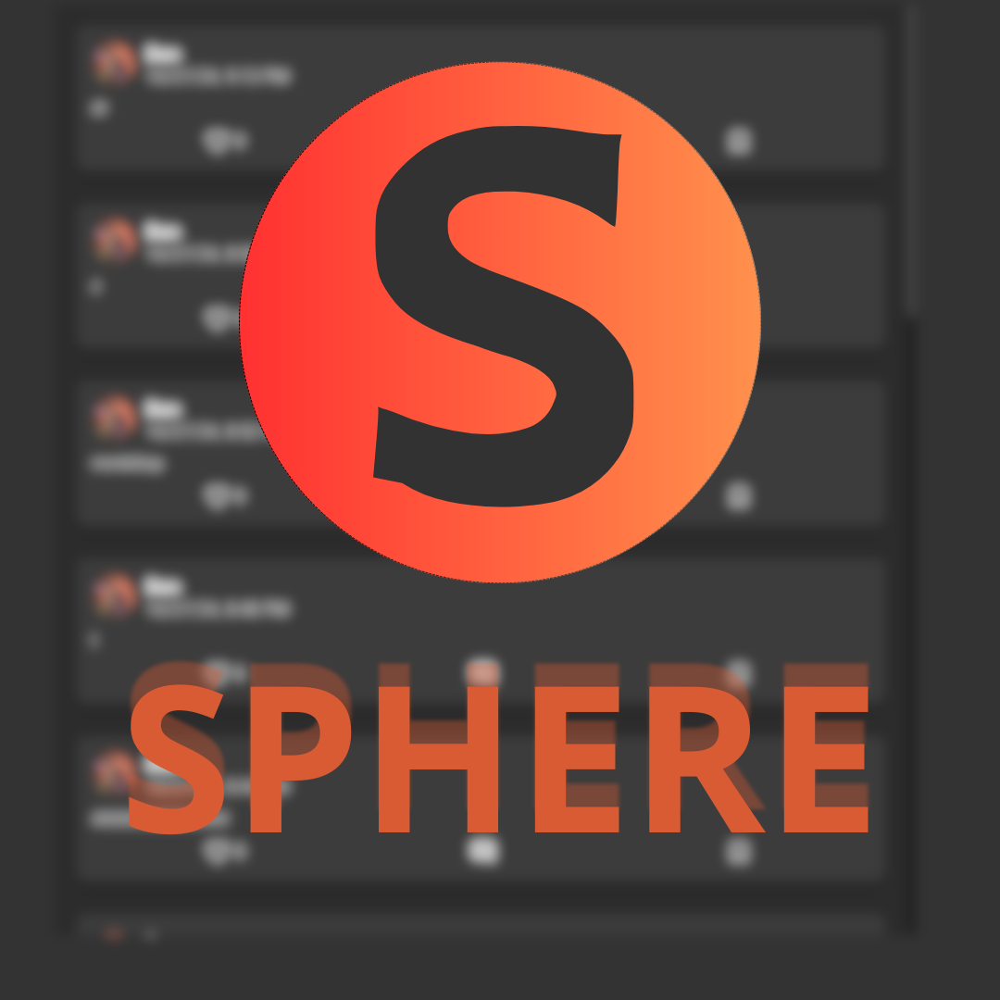
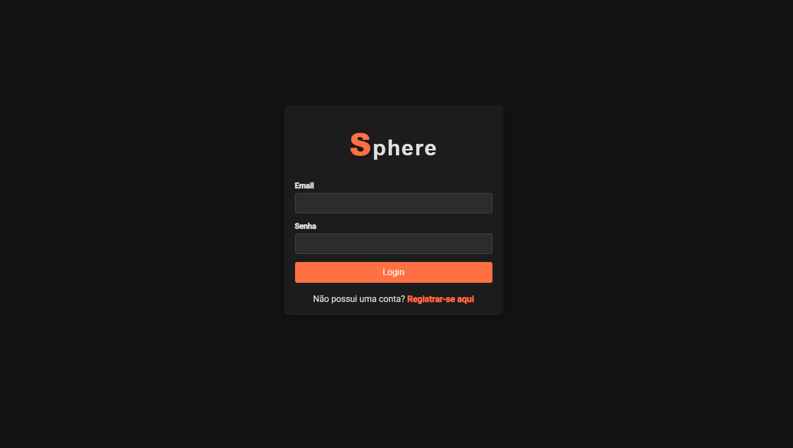
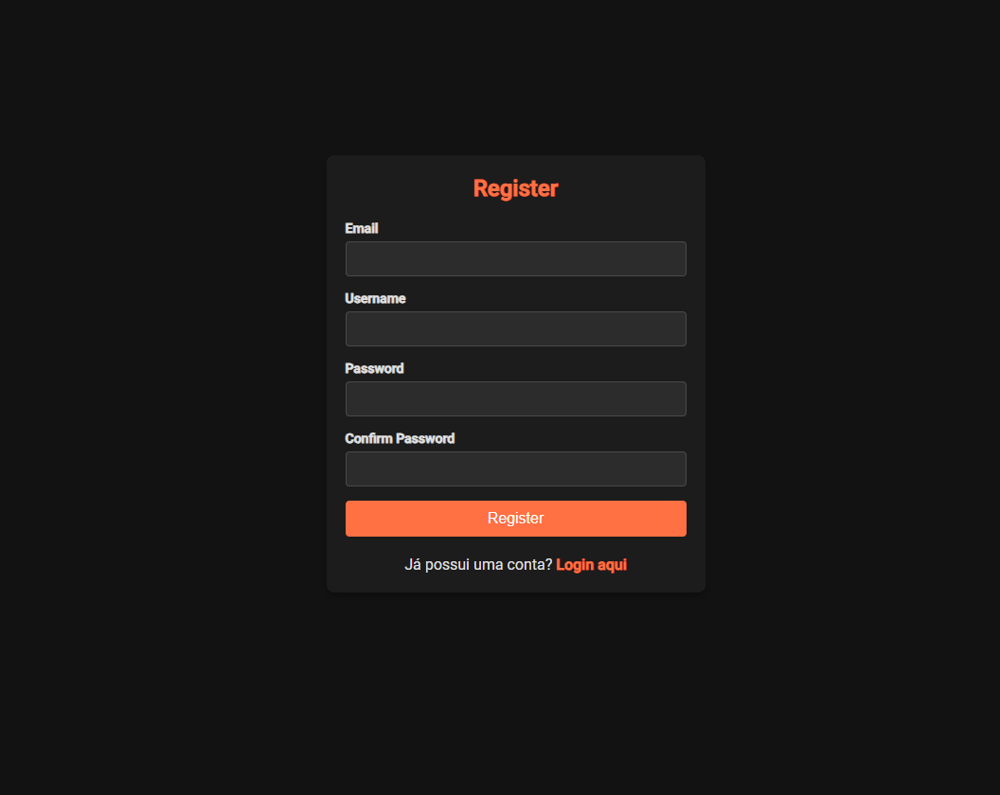
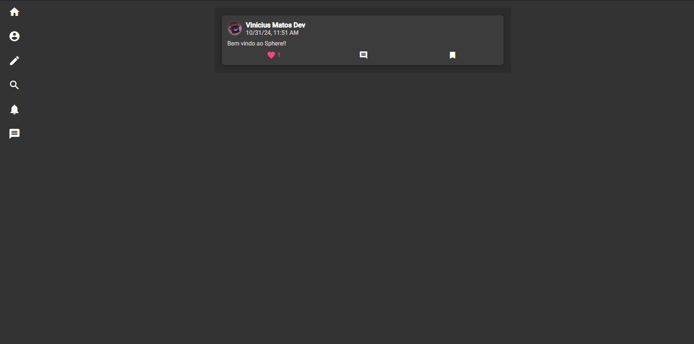
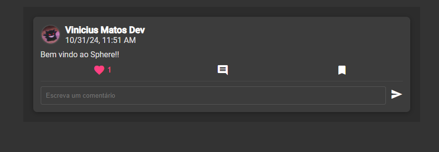
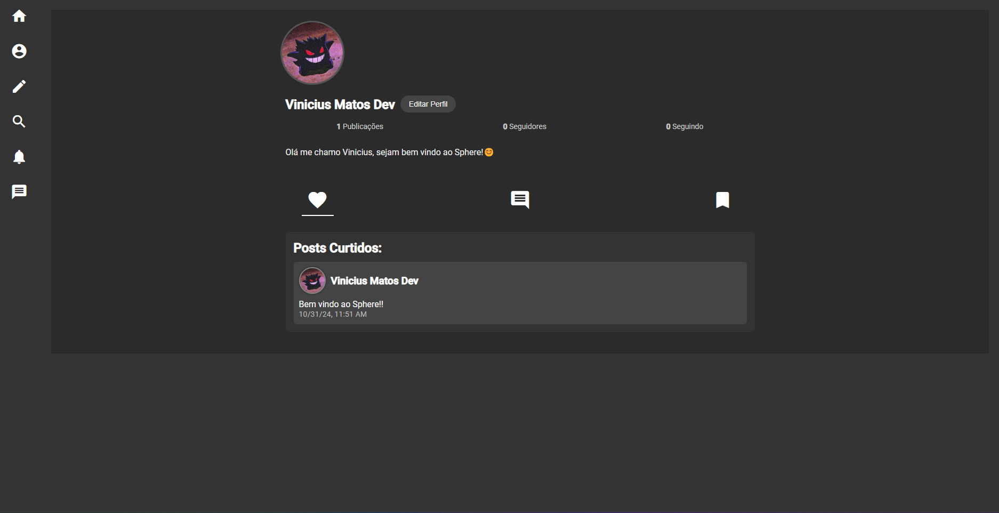
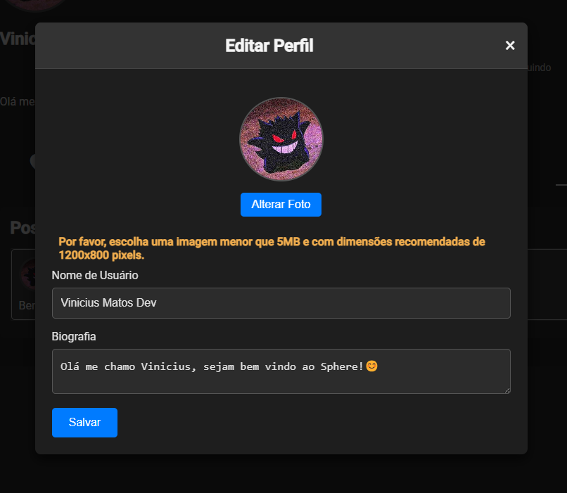
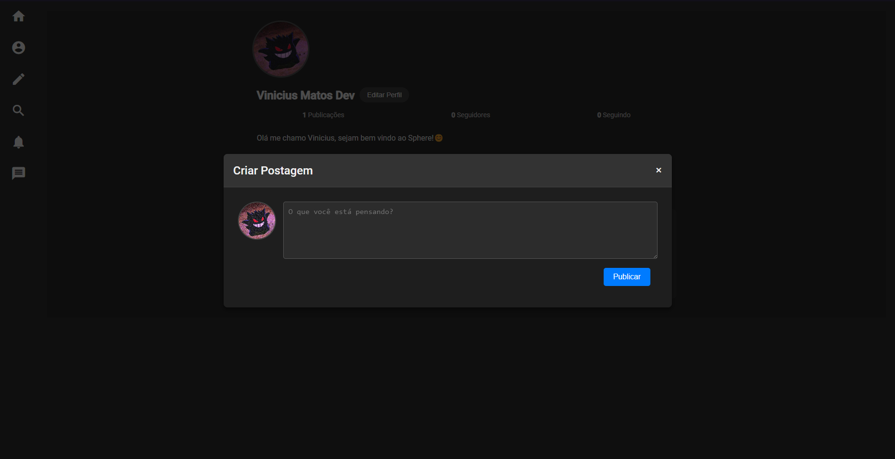

# 🌐 SPHERE



Este projeto é uma rede social que permite que os usuários criem postagens, comentem, curtam e sigam uns aos outros.

## 📜 Sumário

- [🌐 SPHERE](#-sphere)
  - [📜 Sumário](#-sumário)
  - [Componentes do Projeto](#componentes-do-projeto)
    - [Tela de Login](#tela-de-login)
    - [Tela de Registro](#tela-de-registro)
    - [Homepage](#homepage)
    - [Componente de Post](#componente-de-post)
    - [Componente de Perfil](#componente-de-perfil)
    - [Modal de Edição de Perfil](#modal-de-edição-de-perfil)
    - [Modal de Criação de Post](#modal-de-criação-de-post)
    - [Funcionalidades em Desenvolvimento](#funcionalidades-em-desenvolvimento)
  - [🛠️ Tecnologias Utilizadas](#️-tecnologias-utilizadas)
    - [💻 Frontend](#-frontend)
    - [🌐 Backend](#-backend)
  - [💻 Frontend](#-frontend-1)
    - [⚙️ Funcionalidades](#️-funcionalidades)
  - [🌐 Backend](#-backend-1)
    - [📁 Estrutura do Projeto](#-estrutura-do-projeto)
    - [🔗 Rotas Principais](#-rotas-principais)
    - [⚙️ Funcionalidades](#️-funcionalidades-1)
  - [🚀 Instalação](#-instalação)
    - [📋 Pré-requisitos](#-pré-requisitos)
    - [🔧 Configuração do Frontend](#-configuração-do-frontend)

## Componentes do Projeto

### Tela de Login

A tela de login permite que os usuários insiram suas credenciais para acessar suas contas.

### Tela de Registro

Esta tela permite que novos usuários criem uma conta fornecendo informações básicas, como nome de usuário e senha.

### Homepage

A homepage é onde os usuários podem visualizar postagens de outros usuários, interagir com o conteúdo e explorar novas postagens.

### Componente de Post

Este componente exibe uma postagem específica, incluindo texto, imagens, comentários e botões para curtir e compartilhar.

### Componente de Perfil

O componente de perfil mostra as informações do usuário, incluindo bio, imagem de perfil, e suas postagens.

### Modal de Edição de Perfil

Este modal permite que os usuários atualizem suas informações de perfil, como nome de usuário e bio.

### Modal de Criação de Post

Neste modal, os usuários podem criar novas postagens, adicionando texto, imagens e outros conteúdos.

### Funcionalidades em Desenvolvimento

Esta imagem mostra as funcionalidades que estão sendo desenvolvidas, incluindo melhorias na usabilidade e novos recursos planejados.

## 🛠️ Tecnologias Utilizadas

### 💻 Frontend

- **Angular**: Framework usado para construir a interface do usuário.
- **Angular Material**: Biblioteca de componentes UI.
- **TypeScript**: Linguagem de programação utilizada para desenvolvimento.

### 🌐 Backend

- **Node.js**: Ambiente de execução para JavaScript do lado do servidor.
- **Express**: Framework para construir APIs web.
- **MySQL**: Sistema de gerenciamento de banco de dados.
- **jsonwebtoken**: Biblioteca para autenticação de tokens JWT.
- **Multer**: Middleware para upload de arquivos.

## 💻 Frontend

O frontend do projeto é construído em Angular e possui as seguintes características:

- **🧩 Estrutura do Projeto**: O projeto está dividido em componentes independentes, cada um responsável por uma parte da interface.
- **🔌 Serviços**: Utiliza serviços para comunicação com o backend, como `ProfileService` para gerenciar as operações relacionadas ao perfil do usuário.
- **🔄 Gerenciamento de Estado**: Os estados do aplicativo, como informações do perfil do usuário e postagens, são gerenciados localmente no componente.
- **🔒 Autenticação**: O acesso a certas funcionalidades é protegido por autenticação de token.

### ⚙️ Funcionalidades

- **👤 Exibição do Perfil do Usuário**: Carrega e exibe informações do usuário, incluindo imagem de perfil, bio, número de seguidores e postagens.
- **📝 Edição de Perfil**: Permite ao usuário editar seu nome de usuário, bio e imagem de perfil.
- **💬 Interação com Postagens**: Exibe postagens curtidas, comentários feitos e postagens favoritas.
- **📱 Responsividade**: O design é responsivo, adaptando-se a diferentes tamanhos de tela.

## 🌐 Backend

O backend é construído com Node.js e Express, servindo como a API para o frontend. Abaixo estão os detalhes das principais rotas e funcionalidades:

### 📁 Estrutura do Projeto

- **Controllers**: Contém a lógica de negócios para gerenciar usuários e postagens (`userController.js`).
- **Middleware**: Inclui autenticação e upload de arquivos (`multer.js`).
- **Routes**: Define as rotas da API para usuários (`userRoutes.js`).
- **Uploads**: Pasta para armazenar imagens de perfil e outros uploads.

### 🔗 Rotas Principais

- `GET /profile`: Obtém o perfil do usuário logado.
- `PUT /profile`: Atualiza o perfil do usuário, permitindo o upload de uma nova imagem de perfil.
- `GET /posts`: Obtém postagens do usuário.
- `GET /likes`: Obtém postagens que o usuário curtiu.
- `GET /comments`: Obtém comentários feitos pelo usuário.
- `GET /favorites`: Obtém postagens favoritas do usuário.

### ⚙️ Funcionalidades

- **🔐 Autenticação**: Implementa autenticação JWT para proteger rotas.
- **✅ Validação de Dados**: Valida as entradas do usuário, como nome de usuário e tamanho da imagem de perfil.
- **⚠️ Gerenciamento de Erros**: Retorna mensagens de erro apropriadas quando ocorrem falhas nas operações.

## 🚀 Instalação

### 📋 Pré-requisitos

- Node.js e npm
- MySQL

### 🔧 Configuração do Frontend

1. Clone o repositório:
   ```bash
   git clone https://github.com/viniciusfelixmatos/Sphere
   cd Sphere
