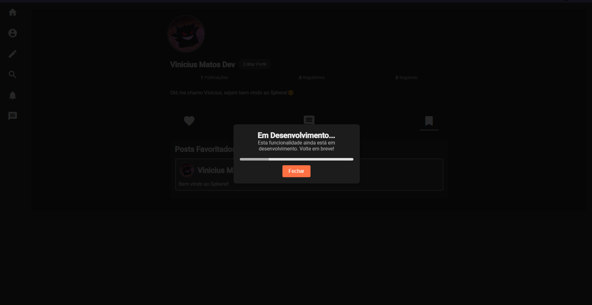

# 🌐 SPHERE


Este projeto é uma rede social que permite que os usuários criem postagens, comentem, curtam e sigam uns aos outros.

## 📜 Sumário

- [🌐 SPHERE](#-sphere)
  - [📜 Sumário](#-sumário)
  - [Componentes do Projeto](#componentes-do-projeto)
    - [Tela de Login](#tela-de-login)
    - [Tela de Registro](#tela-de-registro)
    - [Homepage](#homepage)
    - [Componente de Post](#componente-de-post)
    - [Componente de Perfil](#componente-de-perfil)
    - [Modal de Edição de Perfil](#modal-de-edição-de-perfil)
    - [Modal de Criação de Post](#modal-de-criação-de-post)
    - [Funcionalidades em Desenvolvimento](#funcionalidades-em-desenvolvimento)
  - [🛠️ Tecnologias Utilizadas](#️-tecnologias-utilizadas)
    - [💻 Frontend](#-frontend)
  - [🌐 Backend](#-backend)
    - [📁 Estrutura do Projeto](#-estrutura-do-projeto)
    - [🔗 Rotas Principais](#-rotas-principais)
    - [⚙️ Funcionalidades](#️-funcionalidades)
  - [🚀 Instalação](#-instalação)
    - [📋 Pré-requisitos](#-pré-requisitos)
    - [🔧 Configuração do Frontend](#-configuração-do-frontend)

## Componentes do Projeto

### Tela de Login

A tela de login permite que os usuários insiram suas credenciais para acessar suas contas.

### Tela de Registro

A tela de registro é onde os novos usuários são cadastrados no banco de dados, inserindo informações como "Email", "Username", "Password" e "Confirm Password". O sistema verifica se o e-mail já está em uso e, em caso negativo, a senha é armazenada de forma segura, utilizando um hash criptografado com a biblioteca bcrypt. Após o registro, o usuário é adicionado ao banco de dados com uma imagem de perfil definida por padrão.

### Homepage

A homepage é onde os usuários podem visualizar postagens de outros usuários, interagir com o conteúdo e explorar novas postagens.

### Componente de Post

Este componente exibe uma postagem específica, incluindo os botões como curtir, comentários e o botão de favoritar.

### Componente de Perfil

O componente de perfil mostra as informações do usuário, incluindo a bio, imagem de perfil, e suas postagens. Também exibe botões que permitem acessar as postagens que o usuário curtiu, os comentários que ele fez e os posts que ele favoritou, além de mostrar o número de seguidores e seguindo.

### Modal de Edição de Perfil

Este modal permite que os usuários atualizem suas informações de perfil, como nome de usuário, bio e também a foto de perfil.

### Modal de Criação de Post

Neste modal, os usuários podem criar novas postagens, adicionando texto, mas atualmente não é possível adicionar imagens.

### Funcionalidades em Desenvolvimento

Esta imagem mostra as funcionalidades que estão sendo desenvolvidas, incluindo melhorias na usabilidade e novos recursos planejados.

## 🛠️ Tecnologias Utilizadas

### 💻 Frontend

- **Angular**: Framework usado para construir a interface do usuário.
- **Angular Material**: Biblioteca de componentes UI.
- **TypeScript**: Linguagem de programação utilizada para desenvolvimento.

## 🌐 Backend

O backend é construído com Node.js e Express, servindo como a API para o frontend. Abaixo estão os detalhes das principais rotas e funcionalidades:

### 📁 Estrutura do Projeto

- **Controllers**: Contém a lógica de negócios para gerenciar usuários e postagens (`userController.js`).
- **Middleware**: Inclui autenticação e upload de arquivos (`multer.js`).
- **Routes**: Define as rotas da API para usuários (`userRoutes.js`).
- **Uploads**: Pasta para armazenar imagens de perfil e outros uploads.

### 🔗 Rotas Principais

- `GET /profile`: Obtém o perfil do usuário logado.
- `PUT /profile`: Atualiza o perfil do usuário, permitindo o upload de uma nova imagem de perfil.
- `GET /posts`: Obtém postagens do usuário.
- `GET /likes`: Obtém postagens que o usuário curtiu.
- `GET /comments`: Obtém comentários feitos pelo usuário.
- `GET /favorites`: Obtém postagens favoritas do usuário.

### ⚙️ Funcionalidades

- **🔐 Autenticação**: Implementa autenticação JWT para proteger rotas.
- **✅ Validação de Dados**: Valida as entradas do usuário, como nome de usuário e tamanho da imagem de perfil.
- **⚠️ Gerenciamento de Erros**: Retorna mensagens de erro apropriadas quando ocorrem falhas nas operações.

## 🚀 Instalação

### 📋 Pré-requisitos

- Node.js e npm
- MySQL

### 🔧 Configuração do Frontend

1. Clone o repositório:
   ```bash
   git clone https://github.com/viniciusfelixmatos/Sphere
   cd Sphere
